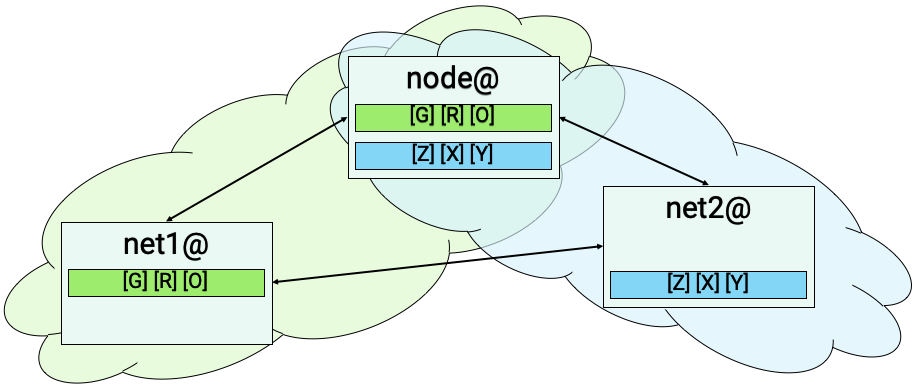

spg: Scalable Process Groups
=====

Replacement for Erlang/OTP pg2 implementation. Implements Strong Eventual 
Consistency (SEC), and an overlay network over Erlang Distribution Cluster.

Primary purpose of this application is to support service discovery.

## Design & Implementation
Terminology
* *Node*. Instance of Erlang Run Time System (ERTS) running in a distributed
environment.
* *Process*. Erlang process running on a single node.
* Process *Owner*. Node that hosts the process.
* *Group*. Collection of processes that can be accessed by a common name. One
process may participate in multiple groups, or in the same group multiple
times.
* *Scope*. Name of the overlay network running on top of Erlang distribution
cluster.

All nodes running spg process with the same scope name form an overlay network




Join/leave calls must be done by the process running on the joining/leaving
process owner node.

**Overlay network discovery protocol**

1. bootstrap:  
   monitor cluster membership  
   broadcast ```{discover, self()}``` to this spg scope on all nodes()
2. handle discover request:  
   monitor requesting process  
   respond with ```{sync, [{Group, LocalPids}]}```
3. handle monitor ‘DOWN’ for remote spg scope process:  
   remove all processes from disconnected scope
4. handle ‘nodeup’: send ```{discover, self()}``` to spg scope of a joined node

**Join/leave protocol**

Join/leave calls are routed through local spg scope process.
Local processes joined the group are monitored. When spg scope detects
monitored process exit, ```leave``` message is sent to all nodes of an
overlay network.

Handling remote spg scope ‘DOWN’ includes removal of all processes 
owned by remote node from the scope.


Relies on message ordering done by Erlang distribution. All exchanges are happening only between
corresponding spg gen_server processes.


## Build
This project has no compile-time or run-time dependencies. Property-based
tests requires PropEr library. 

    $ rebar3 compile

### Running tests
Smoke tests are implemented in spg_SUITE. It is expected to have 100%
line coverage using a single spg_SUITE test suite:
    
    $ rebar3 ct --cover --suite spg_SUITE

Running property-based tests

    $ rebar3 ct --suite spg_cluster_SUITE

This suite uses PropEr library to simulate all possible state changes. 
Unfortunately, OTP Common Test application suffers from issues preventing
using 'cover' tool with multiple slave nodes starting and shutting down 
rapidly. Thus coverage reports are turned off by default.

Running all tests:

    $ rebar3 ct
    
This may take a long time due to a large number of test cases generated.

### Formal model
Used to generate stateful test call sequence.

Generated events:
 * start peer node
 * stop peer node
 * connect to peer node (distribution cluster)
 * disconnect from peer node (distribution cluster)
 * start spc scope process
 * stop spg scope process
 * spawn process on any node in the cluster
 * register process in a group (join)
 * register multiple processes in a group (multi-join)
 * leave group
 * multi-leave
 
Properties:
 * group contains all processes that joined the group on all dist-connected nodes running the same scope
 * group does not contain any other processes (e.g. exited or connected transitively)

## Feature requests
Next releases are going to contain:
 * alternative process registry support
 * customisation for which_groups() to return groups sorted (using ordered_set internally)
 * group membership change notifications
 * delayed spg scope ‘DOWN’ processing to tolerate short network disruptions
 * alternative service discovery integration 
 * region-aware scoping
 * (optional) empty groups (for drop-in pg2 compatibility)


## Changelog
Version 1.0.0:
 - initial release
